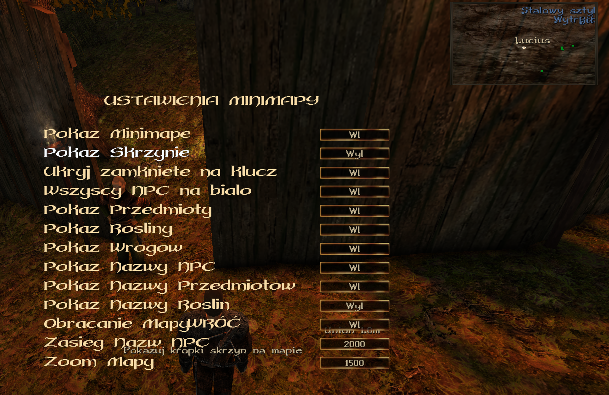
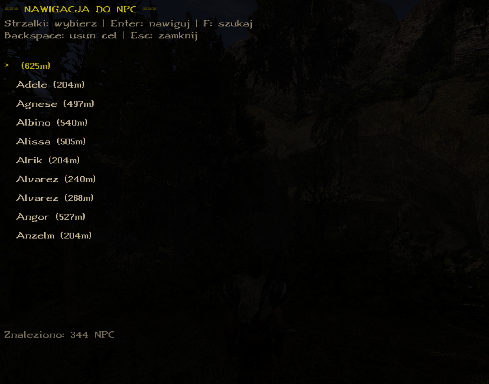
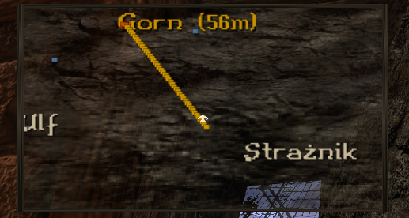
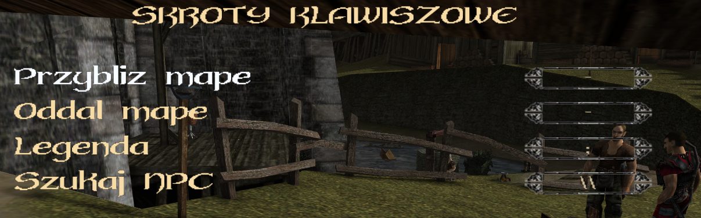
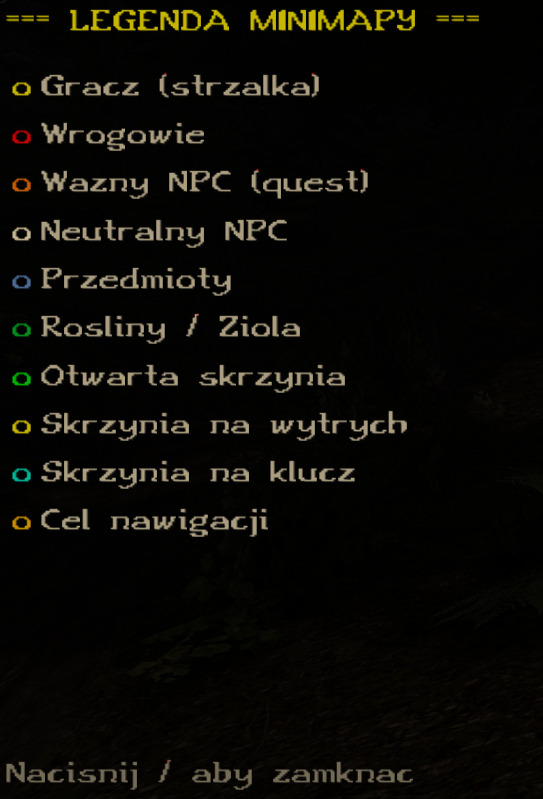

# Gothic 1 & 2 Union Plugin: Tieru Minimap

  

## 📖 Opis / Description

**(PL)** Zaawansowany plugin do gry Gothic 1 i Gothic 2 (Union), dodający funkcjonalną minimapę z wieloma opcjami konfiguracji. Wyświetla pozycje NPC, wrogów, skrzyń, przedmiotów i roślin. Obsługuje rotację mapy zgodnie z kierunkiem postaci, zoom klawiszami, **konfigurowalne skróty klawiszowe** oraz **nawigację do wybranego NPC**.

**(EN)** An advanced Gothic 1 and Gothic 2 (Union) plugin that adds a functional minimap with many configuration options. Displays positions of NPCs, enemies, chests, items, and plants. Supports map rotation according to character direction, keyboard zoom, **customizable keybindings** and **navigation to selected NPC**.

**Kompatybilność / Compatibility:** Gothic 1, Gothic 1 Addon, Gothic 2, Gothic 2 Night of the Raven

### ⚠️ Uwaga o rozwoju / Development Notice

**(PL)** Ten mod został stworzony przy wsparciu narzędzi AI (Gemini 3 Pro oraz Claude 4.5 Opus). Kod może zawierać błędy lub nieoptymalne rozwiązania. Wszelkie zgłoszenia błędów i propozycje ulepszeń są mile widziane w sekcji [Issues](https://github.com/TieruYT/UnionMinimap/issues).

**(EN)** This mod was created with the assistance of AI tools (Gemini 3 Pro and Claude 4.5 Opus). The code may contain bugs or non-optimal solutions. All bug reports and improvement suggestions are welcome in the [Issues](https://github.com/TieruYT/UnionMinimap/issues) section.

## 📸 Screenshots

| Ustawienia Minimapy | Nawigacja do NPC | Linia nawigacji |
|:---:|:---:|:---:|
|  |  |  |

| Skróty klawiszowe | Legenda kolorów | Podgląd VDF |
|:---:|:---:|:---:|
|  |  |  |

## 🌟 Funkcje / Features

### Minimapa / Minimap
*   **Kształt mapy** - Wybierz między kwadratową (z teksturą) a okrągłą (kompas) mapą
*   **Rotacja mapy** - Mapa obraca się zgodnie z kierunkiem postaci (domyślnie włączone)
*   **Zoom klawiszami** - Przybliżaj (`.`) i oddalaj (`,`) mapę w czasie gry (zakres 500-4000)
*   **Strzałka gracza** - Wyraźny wskaźnik pozycji i kierunku gracza (tekstura O.TGA)
*   **Nowa tekstura** - Kamienna tekstura dla kwadratowej mapy (TIERUMENU.TGA)

### Nawigacja do NPC / NPC Navigation (v3.0)
*   **Menu wyboru NPC** - Lista wszystkich NPC w grze z wyszukiwaniem
*   **Linia nawigacji** - Złota linia prowadząca od gracza do wybranego NPC
*   **Automatyczne dotarcie** - Linia znika gdy dotrzesz do celu (< 3m)
*   **Wyszukiwanie** - Filtrowanie NPC po nazwie w czasie rzeczywistym

### Wskaźniki / Markers
| Kolor | Znaczenie (PL) | Meaning (EN) |
|-------|----------------|--------------|
| 🟡 Żółty | Gracz (strzałka) | Player (arrow) |
| 🔴 Czerwony | Wrogowie (zawsze widoczni) | Enemies (always visible) |
| 🟠 Pomarańczowy | Ważny NPC | Important NPC |
| ⚪ Biały | Neutralni NPC | Neutral NPCs |
| 🔵 Niebieski | Przedmioty | Items |
| 🟢 Zielony | Rośliny i zioła | Plants and herbs |
| 🟢 Zielony (skrzynia) | Otwarta skrzynia | Open chest |
| 🟡 Żółty (skrzynia) | Skrzynia na wytrych | Picklock chest |
| 🟦 Cyjan | Skrzynia na klucz | Key chest |
| 🟨 Złoty (linia) | Cel nawigacji | Navigation target |

### Opcje konfiguracji / Configuration Options
Menu dostępne przez: `Opcje → Union → Tieru Plugins → Ustawienia Minimapy`

| Opcja | Opis (PL) | Description (EN) |
|-------|-----------|------------------|
| Pokaż Minimapę | Włącz/wyłącz minimapę | Enable/disable minimap |
| Pokaż Skrzynie | Wyświetlaj skrzynie | Show chests |
| Ukryj zamknięte na klucz | Ukryj skrzynie wymagające klucza | Hide key-locked chests |
| Wszyscy NPC na biało | NPC bez kolorów (wrogowie nadal czerwoni) | NPCs white (enemies still red) |
| Pokaż Przedmioty | Wyświetlaj przedmioty (niebieskie) | Show items (blue) |
| Pokaż Rośliny | Wyświetlaj rośliny (zielone) | Show plants (green) |
| Pokaż Wrogów | Wyświetlaj wrogów (czerwone) | Show enemies (red) |
| Pokaż Nazwy NPC | Nazwy NPC nad kropkami | NPC names above dots |
| Pokaż Nazwy Przedmiotów | Nazwy przedmiotów | Item names |
| Pokaż Nazwy Roślin | Nazwy roślin i ziół | Plant names |
| Obracanie Mapy | Mapa obraca się z postacią | Map rotates with character |
| Zasięg Nazw NPC | Dystans wyświetlania nazw (1000-3500) | Name display range |
| Zoom Mapy | Przybliżenie mapy (500-4000) | Map zoom level |
| Kształt Mapy | Kwadratowa/Okrągła | Square/Circular map |

## ⌨️ Skróty klawiszowe / Keyboard Shortcuts

### Konfigurowalne skróty / Configurable Shortcuts (v3.1)
Ustaw własne klawisze w menu: `Opcje → Union → Tieru Plugins → Skroty klawiszowe`

| Funkcja | Domyślny klawisz | Default key |
|---------|------------------|-------------|
| Przybliż mapę / Zoom in | `.` | `.` |
| Oddal mapę / Zoom out | `,` | `,` |
| Legenda / Legend | `/` | `/` |
| Szukaj NPC / Search NPC | `P` | `P` |

**Dostępne klawisze / Available keys:**
`A-Z, 0-9, F1-F12, . , ; ' [ ] - = / \ NUM0-9 NUM+ NUM- NUM* PGUP PGDN TAB SPACE`

### Nawigacja do NPC / NPC Navigation (v3.0)
| Klawisz | Akcja (PL) | Action (EN) |
|---------|------------|-------------|
| `P` (domyślnie) | Otwórz/zamknij menu nawigacji | Open/close navigation menu |
| `F` | Włącz tryb wyszukiwania | Enable search mode |
| `↑` `↓` | Wybierz NPC z listy | Select NPC from list |
| `Page Up/Down` | Przewiń listę (10 pozycji) | Scroll list (10 items) |
| `Enter` | Ustaw cel nawigacji | Set navigation target |
| `Backspace` | Wyczyść cel nawigacji | Clear navigation target |
| `Escape` | Zamknij menu / Anuluj szukanie | Close menu / Cancel search |

## ⚠️ Wymagania / Requirements

1.  **Gra / Game:** Gothic 1, Gothic 1 Addon, Gothic 2, Gothic 2 Noc Kruka
2.  **Silnik / Engine:** Union SDK 1.0m lub nowszy / or newer
3.  **Rozdzielczość / Resolution:** Testowano na 2560x1440 (2K)
4.  **Wymagane pluginy / Required plugins:**
    *   `zParserExtender`
    *   `Union_Menu`

## 📥 Instalacja / Installation

**(PL)**
1.  Pobierz najnowszy plik `.vdf` z zakładki [Releases](https://github.com/TieruYT/UnionMinimap/releases)
2.  Umieść plik w folderze `Data/` w katalogu gry Gothic 2
3.  Uruchom grę - minimapa pojawi się automatycznie

**(EN)**
1.  Download the latest `.vdf` file from [Releases](https://github.com/TieruYT/UnionMinimap/releases)
2.  Place the file in the `Data/` folder in your Gothic 2 directory
3.  Launch the game - minimap will appear automatically

## 🛠️ Kompilacja / Build

Wymagania:
- Visual Studio 2019+ (toolset v142)
- Union SDK 1.0m

```bash
1. Otwórz TieruPlugins.sln w Visual Studio
2. Wybierz konfigurację "G2A MD Release"
3. Build Solution (F7)
4. Pliki w folderze Bin/
```

## ⚙️ Ręczna konfiguracja / Manual Configuration

Edytuj `Gothic.ini`:
```ini
[QUESTHELPER_V2]
ShowMinimap=1
ShowChests=1
HideLockedChests=0
AllNpcWhite=1
ShowItems=0
ShowPlants=0
ShowEnemies=1
ShowNpcNames=0
ShowItemNames=0
ShowPlantNames=0
RotateMap=1
NpcNameRange=0
MapZoom=3
```

## 📝 Historia zmian / Changelog

### v3.2 (2025-12-27)
- ✨ **System bindowania klawiszy** - Przypisz dowolny klawisz do funkcji
- ✨ **Nowa tekstura mapy** - Ładniejsza kamienna tekstura dla kwadratowej mapy
- ✨ **Okrągła mapa** - Możliwość zmiany kształtu mapy na okrągły (kompas)
- ✨ **Bliższy zoom** - Dodano wartości 500 i 1000 dla większego przybliżenia
- ✨ **Legenda klawiszy** - Wszystkie bindy opisane w legendzie (domyślnie `/`)
- 🔧 Domyślny klawisz wyszukiwania NPC zmieniony na `P`
- 🔧 Poprawiono zapisywanie bindów między sesjami gry

### v3.1 (2025-12-25)
- ✨ **Wsparcie dla Gothic 1** - Jeden DLL dla G1, G1A, G2, G2A!
- ✨ **Konfigurowalne skróty klawiszowe** - Menu do zmiany klawiszy
- ✨ **Kompas N/E/S/W** - Kierunki świata na ramce minimapy
- ✨ **Legenda kolorów** - Wyświetl klawiszem `/`
- ✨ **20 klawiszy do wyboru** - F1-F6, NUM+/-/*, PGUP/PGDN i więcej
- 🔧 Opcja wyłączenia kompasu w menu

### v3.0 (2025-12-23)
- ✨ **Nawigacja do NPC** - Menu wyboru NPC z wyszukiwaniem (klawisz `\`)
- ✨ **Linia nawigacji** - Złota linia prowadząca do wybranego NPC/wroga
- ✨ **Automatyczne dotarcie** - Linia znika gdy dotrzesz do celu
- ✨ **Filtrowanie NPC** - Wyszukiwanie po nazwie w czasie rzeczywistym
- ✨ **Wyświetlanie dystansu** - Odległość do celu w metrach
- 🔧 Blokowanie sterowania gry podczas korzystania z menu nawigacji

### v2.0 (2025-12-22)
- ✨ Rotacja mapy zgodnie z kierunkiem postaci
- ✨ Zoom mapy klawiszami (`;'` lub `,.`)
- ✨ Wyświetlanie przedmiotów i roślin na mapie
- ✨ Wyświetlanie nazw NPC, przedmiotów i roślin
- ✨ Konfigurowalne zasięgi nazw NPC
- ✨ Strzałka gracza jako tekstura (O.TGA)
- ✨ Wrogowie zawsze czerwoni (nawet przy "Wszyscy NPC na biało")
- ✨ 13 opcji konfiguracyjnych w menu
- 🔧 Optymalizacja renderowania

### v1.0 (2025-12-12)
- ✨ Podstawowa minimapa
- ✨ Wyświetlanie NPC i skrzyń
- ✨ 4 opcje konfiguracyjne

## 🤝 Wkład / Contributing

Zgłoszenia błędów, propozycje funkcji i pull requesty są mile widziane!
- [Issues](https://github.com/TieruYT/UnionMinimap/issues)
- [Pull Requests](https://github.com/TieruYT/UnionMinimap/pulls)

## 📜 Licencja / License

Open source - swobodna modyfikacja i dystrybucja zgodnie z zasadami społeczności Gothic modding.

---

**Autor / Author:** Tieru
**GitHub:** https://github.com/TieruYT/
**Repozytorium / Repository:** https://github.com/TieruYT/UnionMinimap
